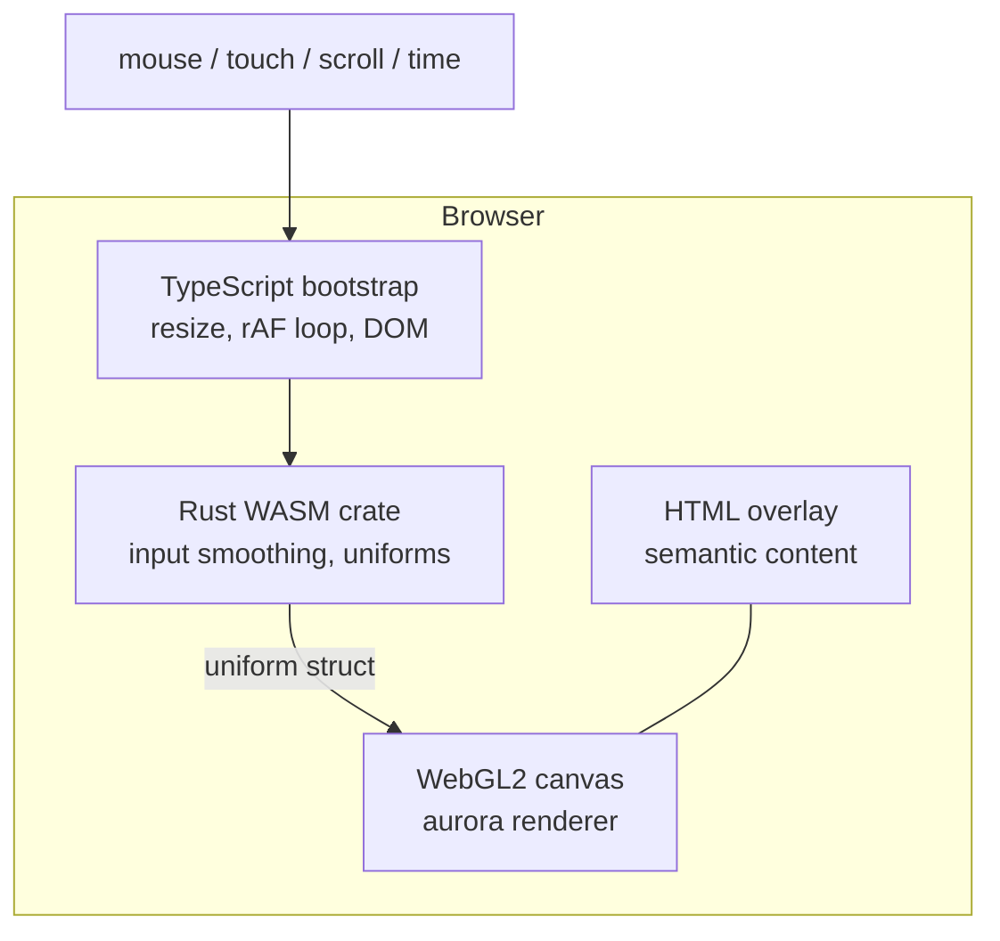

# gussi.is Aurora Personal Site — Design Spec

**Date:** 2026-06-17  
**Status:** Approved (brainstorming)  
**Domain:** gussi.is

---

## Summary

A single-page personal site that functions as a calm, generative art piece: a full-screen aurora borealis rendered in WebGL2, with minimal film-credit typography always visible over the scene. Visitor input (cursor, scroll) subtly influences aurora color and flow. A thin Rust/WASM layer smooths input and drives shader uniforms. Content is limited to name, age, occupation, and links to GitHub, LinkedIn, and X.

---

## Goals

1. **Art first** — The aurora is the primary experience; the site feels like a quiet installation, not a portfolio template.
2. **Minimal content** — Only essential personal info and social links, always readable.
3. **Calm and vast** — Slow motion, dark sky, no urgency or UI chrome.
4. **Subtle interaction** — Cursor and scroll gently shift color temperature and flow; influence should be easy to miss.
5. **Technical showcase (light)** — Rust/WASM participates meaningfully without over-engineering the stack.

## Non-Goals

- Blog, projects gallery, contact form, or resume download
- Heavy 3D scenes, Three.js, or WebGPU (WebGL2 is sufficient and widely supported)
- Audio or video assets
- CMS or server-side rendering
- Complex routing or multi-page structure

---

## User Experience

### First impression (0–3 seconds)

Visitor lands on a near-black viewport. Soft aurora curtains drift slowly in green, teal, and violet. Centered or lower-center typography shows name, age, and occupation in quiet, high-contrast type. No loading spinner, no navigation bar.

### Steady state

- Aurora loops with a **10–15 minute perceived cycle** — layers drift at different speeds so the scene never feels frozen or repetitive within a short visit.
- Typography remains fixed in viewport space (does not parallax with the sky).
- Social links are inline text (GitHub · LinkedIn · X), understated, keyboard-focusable.

### Interaction

| Input | Effect | Intensity |
|-------|--------|-----------|
| **Cursor movement** | Within ~200px influence radius, aurora ribbons bend slightly toward cursor; color shifts marginally cooler → warmer | Subtle |
| **Scroll** | Vertical parallax on aurora layers only — sensation of moving through altitude | Subtle |
| **Idle** | Fully autonomous drift; no pulsing or attention-seeking animation | Default |

### Reduced motion

When `prefers-reduced-motion: reduce` is set:

- WebGL animation stops after rendering one frame (or a static gradient fallback).
- HTML content and links are unchanged.
- No dependency on canvas motion for readability.

### Mobile

- Touch drag provides the same subtle influence as cursor.
- Fewer aurora layers (2 instead of 3–4).
- Device pixel ratio capped (e.g. `min(devicePixelRatio, 1.5)`).

---

## Visual Design

### Color palette

| Role | Value | Notes |
|------|-------|-------|
| Sky base | `#0a0e14` | Near-black blue |
| Aurora core | `#2dd4a8` – `#4ade80` | Teal / soft green |
| Aurora edge | `#7c3aed` – `#a78bfa` | Violet |
| Warm accent | `#f472b6` (rare) | Occasional highlight |
| Text primary | `#e8e6e3` | Soft off-white |
| Text muted | `#9ca3af` | Age / occupation line |
| Link hover | `#e8e6e3` at full opacity | Underline or opacity shift |

### Typography

- **Name:** Largest size, generous letter-spacing (e.g. `0.15em` tracking on uppercase or small caps).
- **Bio line:** Single line — `{age} · {occupation}`.
- **Links:** Inline with middots, no button styling.
- **Font candidates:** Instrument Serif, Cormorant Garamond, or Inter at weight 300. Final choice at implementation time; prefer one variable or two-weight family to keep payload small.

### Layout

```
              GUSSI

        {age} · {occupation}

    GitHub  ·  LinkedIn  ·  X
```

- Vertically centered or slightly below center (lower-third film-credit placement).
- Max content width ~400px, centered horizontally.
- Text has a soft glow (`text-shadow`) for legibility when aurora brightens behind it.

---

## Architecture



### Responsibility split

| Layer | Responsibility |
|-------|----------------|
| **HTML** | Name, age, occupation, links; SEO; accessibility; focus management |
| **CSS** | Typography, layout, reduced-motion rules, link styles |
| **TypeScript** | Canvas setup, resize handling, `requestAnimationFrame` loop, reading DOM input events, calling WASM, passing uniforms to WebGL |
| **Rust/WASM** | Exponential smoothing of cursor position, scroll offset normalization, time delta, computing final uniform values (flow bias, color temperature, layer phase offsets) |
| **GLSL shaders** | Aurora rendering: multi-layer noise-based ribbons, color ramps, transparency, parallax depth per layer |

### Why shader-first

The aurora visual is authored primarily in fragment shaders using layered simplex/perlin noise. Rust/WASM avoids doing per-pixel work; it only prepares ~10–15 float uniforms per frame. This keeps the WASM bundle small (<50KB gzipped target) while still justifying Rust for smooth, deterministic parameter blending.

---

## Technical Stack

| Tool | Purpose |
|------|---------|
| **Vite** | Dev server, bundling, WASM plugin integration |
| **TypeScript** | Application glue, WebGL bootstrap |
| **Rust + wasm-bindgen + wasm-pack** | Input smoothing and uniform computation |
| **WebGL2** | Rendering (raw API, no Three.js) |
| **Static hosting** | Any CDN or static host serving `dist/` |

### Browser support

- WebGL2 required (all modern browsers; ~97% global support).
- Graceful degradation: if WebGL2 unavailable, show dark CSS gradient background; HTML content still fully functional.

---

## Project Structure

```
gussi-is/
├── index.html              # Semantic content overlay + canvas
├── src/
│   ├── main.ts             # Entry: init WASM, WebGL, input listeners
│   ├── webgl/
│   │   ├── renderer.ts     # WebGL2 context, program, draw loop
│   │   ├── shaders.ts      # Shader source strings / load helpers
│   │   └── uniforms.ts     # Uniform location caching and upload
│   └── styles/
│       └── main.css        # Typography, layout, a11y
├── wasm/
│   ├── Cargo.toml
│   └── src/
│       └── lib.rs          # Smoothing, uniform struct, wasm exports
├── public/                 # Favicon, optional font files
├── vite.config.ts
├── package.json
└── docs/
```

---

## WASM Interface

### Exported functions (Rust → JS)

```rust
// Initialize internal state (seed, smoothing factors)
pub fn init(seed: f32) -> ();

// Call once per frame; returns uniform values as a flat f32 array or JS object
pub fn tick(
    dt: f32,
    cursor_x: f32,      // normalized 0–1 viewport
    cursor_y: f32,
    scroll_y: f32,      // normalized scroll offset
    time: f32,          // elapsed seconds
) -> Uniforms;
```

### Uniform struct (passed to shaders)

| Field | Type | Purpose |
|-------|------|---------|
| `u_time` | float | Global time for noise sampling |
| `u_cursor` | vec2 | Smoothed cursor position (0–1) |
| `u_scroll` | float | Smoothed scroll offset |
| `u_color_temp` | float | 0 = cool, 1 = warm; derived from cursor proximity |
| `u_flow_bias` | vec2 | Subtle directional offset for noise domain |
| `u_resolution` | vec2 | Canvas size in pixels |

---

## Shader Approach

### Vertex shader

Full-screen triangle (single VBO, no geometry load).

### Fragment shader

- **4 aurora layers**, each with:
  - Independent time scale (e.g. 0.3×, 0.5×, 0.7×, 1.0×)
  - Vertical curtain mask (smoothstep on Y with noise-modulated edges)
  - 2–3 octaves of simplex noise for ribbon distortion
  - Per-layer color mix (core green → edge violet)
  - Alpha falloff at edges
- **Cursor influence:** offset noise UV toward `u_flow_bias` within falloff radius; blend `u_color_temp` into layer color mix.
- **Scroll influence:** add `u_scroll * layer_depth` to noise Y coordinate (parallax).
- **Composite:** additive blend with clamp; final tone mapping to prevent blow-out.
- **Sky base:** dark gradient before aurora layers.

### Performance targets

- 60 fps on mid-range desktop at 1080p
- 30 fps acceptable on mobile with layer reduction
- GPU-only per frame after init; no CPU pixel loops

---

## Content Configuration

Personal data lives in `index.html` (or a single `content.json` imported at build time — HTML preferred for simplicity and SEO).

```html
<h1 class="name">Gussi</h1>
<p class="bio"><span class="age">28</span> · <span class="occupation">Software engineer</span></p>
<nav class="links" aria-label="Social links">
  <a href="https://github.com/…" rel="me">GitHub</a>
  <span aria-hidden="true"> · </span>
  <a href="https://linkedin.com/in/…" rel="me">LinkedIn</a>
  <span aria-hidden="true"> · </span>
  <a href="https://x.com/…" rel="me">X</a>
</nav>
```

Replace placeholder age, occupation, and URLs with real values during implementation.

---

## Accessibility

- Canvas: `aria-hidden="true"` — decorative only.
- All meaningful content in HTML, not rendered into canvas.
- Links: visible `:focus-visible` outline (e.g. soft white ring).
- `prefers-reduced-motion`: disable animation loop; static frame or CSS fallback.
- Sufficient contrast: text `#e8e6e3` on `#0a0e14` base exceeds WCAG AA even without aurora.
- Page `<title>` and meta description set for SEO.

---

## Build and Deploy

### Development

```bash
npm install
npm run dev          # Vite dev server with WASM rebuild on change
```

### Production build

```bash
wasm-pack build wasm --target web --out-dir ../src/wasm/pkg
npm run build        # Outputs to dist/
```

### Deploy

Upload `dist/` to static host for gussi.is. No server runtime required.

### Estimated bundle size

| Asset | Target |
|-------|--------|
| WASM | < 50 KB gzipped |
| JS (app) | < 20 KB gzipped |
| CSS | < 5 KB |
| Fonts (if self-hosted) | < 80 KB (one family) |
| **Total** | < 200 KB excluding fonts |

---

## Testing and Verification

| Check | Method |
|-------|--------|
| WASM loads and exports `tick` | Manual + console check in dev |
| Aurora renders | Visual inspection at 1080p and mobile viewport |
| Cursor influence | Move cursor near center; confirm subtle color/flow shift |
| Scroll parallax | Scroll page; aurora shifts, text stays fixed |
| Reduced motion | Enable in OS; confirm static fallback |
| Keyboard nav | Tab through links; focus ring visible |
| WebGL fallback | Disable WebGL in browser; gradient + content visible |
| Performance | DevTools performance panel; target 60fps desktop |

No automated visual regression tests in v1 — manual verification is sufficient for an art piece of this scope.

---

## Future Enhancements (out of scope for v1)

- Time-of-day palette shifts based on visitor local time
- WASM flow-field texture (approach #2 from brainstorming)
- Custom favicon matching aurora palette
- Open Graph image for link previews

---

## Decisions Log

| Decision | Choice | Rationale |
|----------|--------|-----------|
| Mood | Calm and vast (aurora) | User preference |
| Content visibility | Always visible overlay | Film-credit style; no hidden info |
| Interaction | Subtle cursor/scroll influence | User preference |
| Architecture | Shader-first with thin WASM | Best art/performance ratio |
| Framework | None (Vite + raw WebGL2) | Minimal payload for a single canvas page |
| Content source | HTML | SEO and accessibility |
